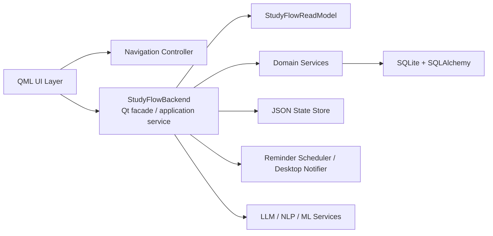

# High-Level Design

## Overview

Smart Study Schedule System is an offline-first desktop application for planning study work, managing syllabus structure, scheduling revisions, tracking sessions, and generating local study insights. The system is implemented as a single-process desktop application using `PySide6` and `QML` for the user interface, with an in-process Python backend that owns business logic, persistence, scheduling, reminders, and local AI/NLP integrations.

The current implementation follows a modular monolith architecture:

- Presentation layer in QML
- Application/service layer in Python exposed to QML through Qt context properties
- Domain services for scheduling, topic management, reminders, and analytics support
- Local persistence using SQLite for core domain data
- Supplemental JSON persistence for lightweight UI and user-preference state

## Goals

- Support a responsive desktop study planner without requiring network access
- Keep all core study data available locally
- Provide revision scheduling and workload balancing across subjects
- Support future sync or cloud integration without making it a runtime dependency
- Keep the architecture simple enough for desktop packaging and single-user operation

## Non-Goals

- Multi-user collaboration
- Distributed deployment
- Remote-first or browser-based architecture
- External database dependency for local usage

## System Context

Primary user interactions:

- Manage subjects and topics
- Review scheduled revisions
- Start and stop study sessions
- Track progress and confidence
- Receive reminders and notifications
- Use an optional local AI assistant

External dependencies are optional and local-first:

- Ollama or local model runtime for assistant features
- Local filesystem for JSON state, SQLite database, logs, and exports

## Architectural Style

The application is a layered modular monolith.

Major characteristics:

- Single executable/runtime process
- No separate API server
- In-process calls between UI, backend facade, domain services, and repositories
- Local persistence only
- Strong coupling to Qt/QML event flow at the application boundary

## High-Level Component View

## Component Design

## 1. Presentation Layer

Main responsibilities:

- Render screens and widgets in QML
- Bind to backend properties and invoke backend slots
- Present dashboards, curriculum views, calendar, notifications, settings, and AI assistant screens

Key files:

- [Main.qml](/D:/4S/Study_Flow/Main.qml)
- [DashboardScreen.qml](/D:/4S/Study_Flow/DashboardScreen.qml)
- [CurriculumMapScreen.qml](/D:/4S/Study_Flow/CurriculumMapScreen.qml)
- [RevisionScheduleScreen.qml](/D:/4S/Study_Flow/RevisionScheduleScreen.qml)
- [NotificationsScreen.qml](/D:/4S/Study_Flow/NotificationsScreen.qml)
- [SettingsScreen.qml](/D:/4S/Study_Flow/SettingsScreen.qml)

Design notes:

- QML does not directly access the database.
- QML communicates through `backend` and `navigation` context properties registered in `main.py`.

## 2. Application Facade

Main responsibilities:

- Expose Qt-friendly properties and slots to the UI
- Orchestrate persistence, scheduling, reminders, AI interactions, and state refresh
- Normalize data into QML-ready payloads
- Handle app startup, shutdown, and refresh flows

Key file:

- [studyflow_backend/service_db.py](/D:/4S/Study_Flow/studyflow_backend/service_db.py)

Design notes:

- `StudyFlowBackend` is the central orchestration component.
- It acts as the main boundary between the UI and the domain model.
- It owns database session-factory setup and coordinates both SQLite and JSON state persistence.

## 3. Read Model / Projection Layer

Main responsibilities:

- Read domain entities from the database
- Convert ORM entities into presentation payloads
- Compute derived values such as confidence, urgency, buckets, and grouped task views

Key file:

- [studyflow_backend/viewmodels.py](/D:/4S/Study_Flow/studyflow_backend/viewmodels.py)

Design notes:

- This is effectively a read-model layer optimized for the UI.
- It keeps view-specific transformation logic out of QML and out of low-level repositories.

## 4. Domain Services

Main responsibilities:

- Implement scheduling and revision progression rules
- Manage subject/topic lifecycle
- Generate reminder summaries and exam warnings
- Export revision calendar data

Key files:

- [services/scheduler.py](/D:/4S/Study_Flow/services/scheduler.py)
- [services/topic_management.py](/D:/4S/Study_Flow/services/topic_management.py)
- [services/reminders.py](/D:/4S/Study_Flow/services/reminders.py)

Important behaviors:

- Create first revision for a topic
- Process revision completion and schedule the next revision
- Rebalance open revisions based on daily study-time limits
- Preserve one open revision per topic
- Adjust mastery score and performance logs after reviews

## 5. Persistence Layer

Main responsibilities:

- Configure SQLite engine and sessions
- Create and initialize schema
- Enforce SQLite pragmas, indexes, and triggers

Key files:

- [db/session.py](/D:/4S/Study_Flow/db/session.py)
- [models/base.py](/D:/4S/Study_Flow/models/base.py)
- [alembic/versions/0001_initial_offline.py](/D:/4S/Study_Flow/alembic/versions/0001_initial_offline.py)
- [alembic/versions/0002_harden_revision_constraints_and_sqlite_artifacts.py](/D:/4S/Study_Flow/alembic/versions/0002_harden_revision_constraints_and_sqlite_artifacts.py)

Design notes:

- SQLAlchemy ORM is the data-access mechanism.
- SQLite is configured with `foreign_keys=ON`, `journal_mode=WAL`, and `synchronous=NORMAL`.
- Startup initialization can recreate the DB if critical schema expectations are not met.

## 6. JSON State Store

Main responsibilities:

- Persist lightweight app state outside the relational schema
- Store settings, reminder preferences, assistant chat history, and UI notification feed

Key file:

- [studyflow_backend/storage.py](/D:/4S/Study_Flow/studyflow_backend/storage.py)

Design notes:

- This complements SQLite rather than replacing it.
- The current design separates core study data from lightweight, mutable UI/session state.

## 7. AI / NLP / ML Support

Main responsibilities:

- Provide assistant answers
- Predict topic difficulty from text
- Refresh learning-intelligence metrics asynchronously

Key files:

- [llm/assistant.py](/D:/4S/Study_Flow/llm/assistant.py)
- [nlp/difficulty_predictor.py](/D:/4S/Study_Flow/nlp/difficulty_predictor.py)
- [studyflow_backend/ml_engine.py](/D:/4S/Study_Flow/studyflow_backend/ml_engine.py)

Design notes:

- AI is optional and non-critical to core task management.
- Core planning and scheduling remain local and functional without external network services.

## Runtime Flow

## Startup Flow

1. `main.py` configures logging and ensures required directories exist.
2. Qt application and QML engine are created.
3. `StudyFlowBackend` is initialized.
4. SQLite engine, session factory, and schema initialization are performed.
5. JSON state is loaded.
6. Read model, ML engine, and reminder scheduler are initialized.
7. `backend` and `navigation` are injected into the QML context.
8. `Main.qml` is loaded and the event loop starts.

## Topic Creation Flow

1. User submits a new topic from the UI.
2. QML calls a `StudyFlowBackend` slot.
3. Backend delegates to `TopicService`.
4. `TopicService` persists the topic and optionally creates the first revision through `SchedulerService`.
5. Scheduler rebalances the open revision queue.
6. Backend emits state change so the UI refreshes projections.

## Revision Completion Flow

1. User marks a revision complete with a rating.
2. Backend loads the target revision.
3. `SchedulerService` marks the current revision completed.
4. `SchedulerService` calculates the next interval and creates the next open revision.
5. Topic mastery, review count, and performance log are updated.
6. Backend updates lightweight history, notifications, and intelligence refresh requests.
7. UI re-renders updated task lists and metrics.

## Data Model Summary

Core relational entities:

- `subjects`
- `topics`
- `revisions`
- `study_sessions`
- `performance_logs`
- `tasks`
- `notifications`
- `app_settings`

Core relationships:

- One `subject` has many `topics`
- One `topic` has many `revisions`
- One `topic` has many `study_sessions`
- One `topic` has many `performance_logs`
- `revisions` can reference a prior `revision`

Important design rules:

- Subject names are unique
- Topic names are unique within a subject
- Only one open revision can exist for a topic at a time
- Difficulty, status, priority, and rating values are constrained with DB checks

## Persistence Strategy

System of record split:

- SQLite stores structured domain data and historical records
- JSON stores lightweight UI/application state

SQLite is used for:

- subjects
- topics
- revision schedule and review history
- study sessions
- performance logs
- tasks
- persisted app settings

JSON is used for:

- reminder preferences
- assistant message history
- alert toggles
- rolling study-minute values
- recent UI notification feed
- active session snapshot

## Deployment View

The application is packaged as a desktop application and runs locally on a single machine.

Deployment artifacts:

- Python runtime and packaged application files
- QML assets
- local SQLite database file under configured `data/`
- JSON state file in app-data storage
- log file under `logs/`

There is no separate deployment unit for backend services or databases.

## Quality Attributes

## Availability

- Core features are available offline
- Local storage avoids dependency on external services

## Performance

- SQLite with WAL mode is suitable for the current single-user desktop workload
- Read projections keep UI-friendly transformations centralized

## Maintainability

- Clear separation exists between UI, orchestration, domain services, and persistence
- Centralized backend facade simplifies QML integration
- Risk: `StudyFlowBackend` is large and acts as a god-object boundary

## Reliability

- DB constraints and indexes protect key invariants
- Session-scope transaction handling reduces partial-write risk
- JSON writes use temp-file replacement for safer persistence

## Security and Privacy

- Study data is stored locally by default
- No mandatory cloud dependency exists
- Assistant/chat data is stored locally in the JSON state file

## Risks and Design Constraints

- `StudyFlowBackend` currently carries many responsibilities and may become harder to evolve safely
- The split persistence model increases complexity because some state lives outside the relational schema
- Topic hierarchy is currently encoded in `topics.description` metadata instead of a dedicated parent column
- DB reset logic on startup is convenient for development but risky if schema drift occurs in production without controlled migration

## Recommended Next Evolution

1. Split `StudyFlowBackend` into smaller application services by feature area.
2. Move topic parent relationship into a first-class `parent_topic_id` column.
3. Decide whether notifications and session state should fully live in SQLite instead of being duplicated in JSON/UI state.
4. Formalize a stable migration-only schema evolution path and reduce automatic reset behavior.
5. Add explicit repository/use-case boundaries if the backend continues to grow.

